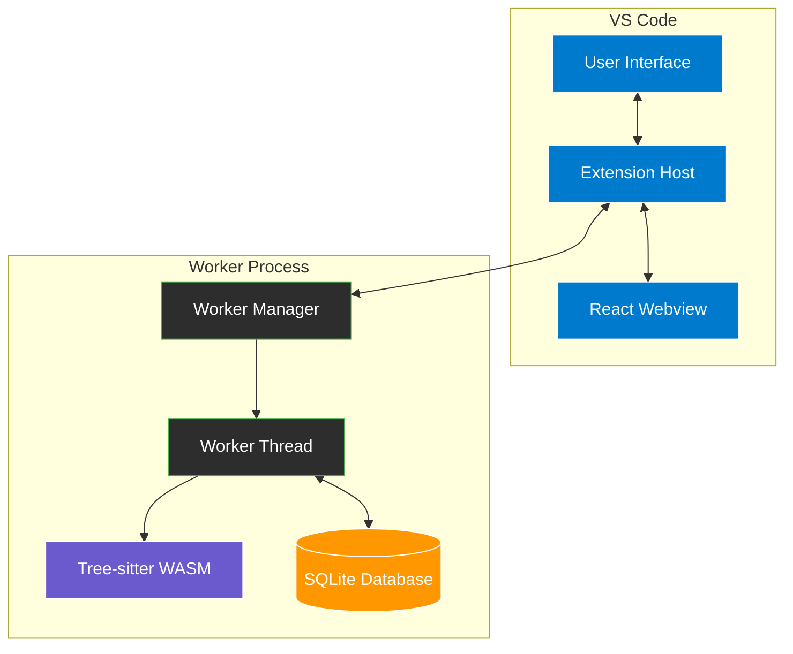
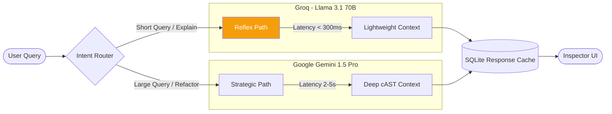

# Sentinel Flow - Design Specification

## Document Information

- **Project**: Sentinel Flow VS Code Extension
- **Version**: 0.1.0
- **Status**: Production
- **Last Updated**: 2026-03-04
- **Document Type**: Design Specification

## 1. System Overview

### 1.1 Architecture Philosophy

Sentinel Flow follows a **multi-threaded, event-driven architecture** with clear separation between:
- **Extension Host** (main thread): UI coordination, command handling
- **Worker Thread**: CPU-intensive parsing, database operations, AI calls
- **Webview**: Interactive graph visualization (React-based)

This design ensures the VS Code UI remains responsive even during intensive operations like indexing large codebases or performing AI analysis.

### 1.2 Core Design Principles

1. **Performance First**: All blocking operations run in worker threads
2. **Incremental Everything**: Parse only what changed, render only what's visible
3. **Fail Gracefully**: Fallback mechanisms for all external dependencies
4. **Cache Aggressively**: Minimize redundant computation and API calls
5. **Progressive Disclosure**: Show high-level first, details on demand
6. **Type Safety**: Strict TypeScript throughout
7. **Testability**: Pure functions, dependency injection, clear interfaces

## 2. System Architecture

### 2.1 High-Level Component Diagram

```
┌─────────────────────────────────────────────────────────────────┐
│                     VS Code Extension Host                       │
│                                                                   │
│  ┌──────────────┐  ┌──────────────┐  ┌──────────────┐          │
│  │  Extension   │  │   Sidebar    │  │   Webview    │          │
│  │  Controller  │  │   Provider   │  │   Provider   │          │
│  │              │  │              │  │              │          │
│  │ - Commands   │  │ - Controls   │  │ - Graph UI   │          │
│  │ - Lifecycle  │  │ - Settings   │  │ - Inspector  │          │
│  │ - Config     │  │ - Actions    │  │ - Filters    │          │
│  └──────┬───────┘  └──────────────┘  └──────┬───────┘          │
│         │                                     │                  │
│         └─────────────────┬───────────────────┘                  │
│                           │                                      │
│                    ┌──────▼───────┐                             │
│                    │    Worker    │                             │
│                    │    Manager   │                             │
│                    │              │                             │
│                    │ - IPC Queue  │                             │
│                    │ - Timeout    │                             │
│                    │ - Restart    │                             │
│                    └──────┬───────┘                             │
└───────────────────────────┼──────────────────────────────────────┘
                            │ Message Passing (IPC)
                    ┌───────▼────────┐
                    │  Worker Thread │
                    │                │
                    │  ┌──────────┐  │
                    │  │  Parser  │  │
                    │  │ Extractor│  │
                    │  │ Database │  │
                    │  │    AI    │  │
                    │  │ Inspector│  │
                    │  └──────────┘  │
                    └────────────────┘
```


### 2.2 Data Flow Architecture

#### 2.2.1 Indexing Pipeline

```
┌─────────────┐     ┌──────────────┐     ┌──────────────┐
│   Source    │────▶│ Tree-sitter  │────▶│   Symbol     │
│   Files     │     │   Parser     │     │  Extractor   │
└─────────────┘     └──────────────┘     └──────┬───────┘
                                                  │
                                                  ▼
┌─────────────┐     ┌──────────────┐     ┌──────────────┐
│   SQLite    │◀────│  Composite   │◀────│   String     │
│  Database   │     │    Index     │     │  Registry    │
└─────────────┘     └──────────────┘     └──────────────┘
```

**Flow Description**:
1. Source files read from disk
2. Tree-sitter parses into AST
3. Symbol Extractor traverses AST, extracts symbols and relationships
4. String Registry interns strings for O(1) lookups
5. Composite Index resolves cross-file references
6. SQLite Database persists symbols and edges

#### 2.2.2 Visualization Pipeline

```
┌─────────────┐     ┌──────────────┐     ┌──────────────┐
│   SQLite    │────▶│    Graph     │────▶│  View Mode   │
│  Database   │     │    Export    │     │    Filter    │
└─────────────┘     └──────────────┘     └──────┬───────┘
                                                  │
                                                  ▼
┌─────────────┐     ┌──────────────┐     ┌──────────────┐
│   Webview   │◀────│  React Flow  │◀────│     ELK      │
│   (React)   │     │   Renderer   │     │    Layout    │
└─────────────┘     └──────────────┘     └──────────────┘
```

**Flow Description**:
1. Database exports graph data (symbols, edges, domains)
2. View mode filter applies (Architecture/Codebase/Trace)
3. ELK layout algorithm positions nodes
4. React Flow renders interactive graph
5. Webview displays to user

#### 2.2.3 AI Analysis Pipeline

```
┌─────────────┐     ┌──────────────┐     ┌──────────────┐
│    User     │────▶│    Intent    │────▶│   Context    │
│    Query    │     │   Router     │     │   Assembly   │
└─────────────┘     └──────────────┘     └──────┬───────┘
                                                  │
                                                  ▼
┌─────────────┐     ┌──────────────┐     ┌──────────────┐
│  Response   │◀────│  AI Client   │◀────│    Cache     │
│    Cache    │     │ (Groq/Gemini)│     │    Lookup    │
└─────────────┘     └──────────────┘     └──────────────┘
```

**Flow Description**:
1. User submits query
2. Intent Router classifies as reflex or strategic
3. Cache lookup checks for existing response
4. Context Assembly builds prompt with symbol + dependencies
5. AI Client calls appropriate model (Groq/Gemini/Bedrock)
6. Response cached for future queries
7. Result returned to user

## 3. Component Design

### 3.1 Extension Host Components

#### 3.1.1 Extension Controller (`src/extension.ts`)

**Responsibilities**:
- Extension lifecycle management (activate/deactivate)
- Command registration
- Configuration management
- Worker manager initialization
- File watcher setup

**Key Methods**:
```typescript
export async function activate(context: vscode.ExtensionContext): Promise<void>
export async function deactivate(): Promise<void>
async function indexWorkspace(): Promise<void>
async function visualizeGraph(): Promise<void>
async function configureAI(): Promise<void>
```

**Design Decisions**:
- Single entry point for all extension functionality
- Delegates heavy work to worker manager
- Maintains minimal state (only UI-related)
- Uses VS Code's built-in progress indicators


#### 3.1.2 Worker Manager (`src/worker/worker-manager.ts`)

**Responsibilities**:
- Worker thread lifecycle (start/stop/restart)
- Message routing between main thread and worker
- Request timeout management
- Error handling and recovery

**Key Methods**:
```typescript
async start(workerPath: string, storagePath: string): Promise<void>
async parseFile(filePath: string, content: string, language: Language): Promise<ParseResult>
async parseBatch(files: FileInput[]): Promise<BatchResult>
async exportGraph(): Promise<GraphExport>
async querySymbols(query: string): Promise<SymbolResult[]>
async shutdown(): Promise<void>
```

**Design Patterns**:
- **Promise-based IPC**: Each request gets unique ID, resolved via Map
- **Timeout Protection**: 30s default, 200s for AI queries
- **Automatic Restart**: On crash or memory exhaustion
- **Queue Management**: Requests queued until worker ready


#### 3.1.3 Webview Provider (`src/webview-provider.ts`)

**Responsibilities**:
- Webview lifecycle management
- Message passing between extension and webview
- Graph data synchronization
- Inspector panel communication

**Key Methods**:
```typescript
async show(): Promise<void>
async refresh(): Promise<void>
async traceSymbol(symbolId?: number, nodeId?: string): Promise<void>
postMessage(message: any): Promise<void>
```

**Communication Protocol**:
```typescript
// Extension → Webview
type ExtensionMessage = 
  | { type: 'graph-data', data: GraphData }
  | { type: 'architecture-skeleton', data: ArchitectureSkeleton }
  | { type: 'function-trace', data: FunctionTrace }
  | { type: 'filter-by-directory', path: string }
  | { type: 'cache-invalidate' }

// Webview → Extension
type WebviewMessage =
  | { type: 'ready' }
  | { type: 'request-graph' }
  | { type: 'node-selected', nodeId: string }
  | { type: 'inspector-overview', nodeId: string, nodeType: NodeType }
  | { type: 'inspector-ai-action', nodeId: string, action: string }
```

### 3.2 Worker Thread Components

#### 3.2.1 Worker Main (`src/worker/worker.ts`)

**Responsibilities**:
- Message handling and routing
- Database initialization
- Memory monitoring
- Component coordination

**Key Features**:
- **Memory Limit**: 1000MB hard limit, auto-exit on exceed
- **Ready Handshake**: Signals when WASM/DB fully initialized
- **Request Queue**: Buffers requests until ready
- **Transaction Management**: Batch operations for performance


#### 3.2.2 Tree-sitter Parser (`src/worker/parser.ts`)

**Responsibilities**:
- WASM parser initialization
- Language grammar loading
- AST generation

**Supported Languages**:
```typescript
type Language = 'typescript' | 'python' | 'c'

// Grammar files
const GRAMMARS = {
  typescript: 'tree-sitter-typescript.wasm',
  python: 'tree-sitter-python.wasm',
  c: 'tree-sitter-c.wasm'
}
```

**Design Decisions**:
- **Lazy Loading**: Grammars loaded on first use
- **Singleton Pattern**: One parser instance per worker
- **Error Recovery**: Partial AST on syntax errors

#### 3.2.3 Symbol Extractor (`src/worker/symbol-extractor.ts`)

**Responsibilities**:
- AST traversal
- Symbol identification
- Relationship extraction
- Complexity calculation

**Extracted Data**:
```typescript
interface ExtractionResult {
  symbols: NewSymbol[]           // Functions, classes, variables
  pendingCalls: PendingCall[]    // Function calls (unresolved)
  pendingImports: PendingImport[] // Import statements (unresolved)
}
```

**Complexity Calculation**:
- Cyclomatic complexity for functions
- Based on control flow nodes (if, while, for, switch, catch)
- Formula: `complexity = 1 + decision_points`


#### 3.2.4 Composite Index (`src/worker/composite-index.ts`)

**Responsibilities**:
- O(1) symbol resolution
- Cross-file reference resolution
- Import path normalization

**Data Structure**:
```typescript
class CompositeIndex {
  // Map: (nameId, pathId, line) → dbId
  private index: Map<string, number>
  
  register(entry: IndexEntry): void
  resolve(nameId: number, pathId: number, line: number): number | undefined
}
```

**Resolution Algorithm**:
1. For function calls: Match by (name, file, line)
2. For imports: Match by (name, source_path)
3. Fallback: Fuzzy match by name only

**Performance**:
- O(1) lookup time
- O(N) build time (N = number of symbols)
- Memory: ~100 bytes per symbol

#### 3.2.5 Database Layer (`src/db/database.ts`)

**Responsibilities**:
- SQLite operations
- Transaction management
- Query optimization
- Data export

**Schema Design**:
```sql
-- Symbols (nodes)
CREATE TABLE symbols (
  id INTEGER PRIMARY KEY,
  name TEXT NOT NULL,
  type TEXT NOT NULL,
  file_path TEXT NOT NULL,
  range_start_line INTEGER,
  range_end_line INTEGER,
  complexity INTEGER DEFAULT 0,
  domain TEXT,
  purpose TEXT,
  fragility TEXT,
  risk_score INTEGER
);

-- Edges (relationships)
CREATE TABLE edges (
  id INTEGER PRIMARY KEY,
  source_id INTEGER REFERENCES symbols(id) ON DELETE CASCADE,
  target_id INTEGER REFERENCES symbols(id) ON DELETE CASCADE,
  type TEXT NOT NULL,
  reason TEXT
);

-- File tracking
CREATE TABLE files (
  id INTEGER PRIMARY KEY,
  file_path TEXT UNIQUE,
  content_hash TEXT,
  last_indexed_at TEXT
);

-- AI cache
CREATE TABLE ai_cache (
  hash TEXT PRIMARY KEY,
  response TEXT,
  created_at TEXT
);
```

**Indexes**:
```sql
CREATE INDEX idx_symbols_name ON symbols(name);
CREATE INDEX idx_symbols_file_path ON symbols(file_path);
CREATE INDEX idx_symbols_domain ON symbols(domain);
CREATE INDEX idx_edges_source ON edges(source_id);
CREATE INDEX idx_edges_target ON edges(target_id);
```


### 3.3 AI Components

#### 3.3.1 AI Orchestrator (`src/ai/orchestrator.ts`)

**Responsibilities**:
- Query routing (reflex vs strategic)
- Context assembly
- AI client management
- Response caching

**Dual-Path Architecture**:
```typescript
interface AIOrchestrator {
  // Reflex Path: <300ms, simple queries
  executeReflexPath(prompt: string): Promise<AIResponse>
  
  // Strategic Path: 2-5s, deep analysis
  executeStrategicPath(prompt: string, analysisType: string): Promise<AIResponse>
  
  // Automatic routing
  processQuery(query: string, options: AIQueryOptions): Promise<AIResponse>
}
```

**Context Assembly**:
```typescript
interface NodeContext {
  targetSymbol: {
    name: string
    type: string
    filePath: string
    code: string  // Only target symbol code (not neighbors)
  }
  dependencies: {
    outgoing: NodeDependencyStub[]  // Lightweight metadata
    incoming: NodeDependencyStub[]  // No source code
  }
}
```

**Design Rationale**:
- **Minimal Context**: Only target symbol code included
- **Dependency Stubs**: Neighbors represented as metadata (name, type, file)
- **Token Efficiency**: Reduces prompt size by 90%
- **Prevents "Lost in the Middle"**: LLM focuses on relevant code


#### 3.3.2 Intent Router (`src/ai/intent-router.ts`)

**Responsibilities**:
- Query classification
- Confidence scoring
- Routing decision

**Classification Algorithm**:
```typescript
type IntentType = 'reflex' | 'strategic'

interface ClassifiedIntent {
  type: IntentType
  confidence: number  // 0.0 - 1.0
  query: string
}

// Keyword-based classification
const REFLEX_KEYWORDS = ['what', 'explain', 'describe', 'show']
const STRATEGIC_KEYWORDS = ['refactor', 'optimize', 'security', 'architecture']
```

**Decision Logic**:
1. Check for strategic keywords → Strategic path
2. Check for reflex keywords → Reflex path
3. Query length > 50 words → Strategic path
4. Default → Reflex path

#### 3.3.3 AI Clients

**Groq Client** (`src/ai/groq-client.ts`):
```typescript
interface GroqClient {
  complete(prompt: string, systemPrompt: string): Promise<AIResponse>
}

// Configuration
const GROQ_CONFIG = {
  model: 'llama-3.1-70b-versatile',
  temperature: 0.3,
  max_tokens: 500,
  timeout: 5000  // 5s
}
```

**Gemini Client** (`src/ai/gemini-client.ts`):
```typescript
interface GeminiClient {
  analyzeCode(prompt: string, context: string[], analysisType: string): Promise<AIResponse>
}

// Configuration
const GEMINI_CONFIG = {
  model: 'gemini-1.5-pro-latest',
  temperature: 0.5,
  max_tokens: 2000,
  timeout: 30000  // 30s
}
```

**Bedrock Client** (`src/ai/bedrock-client.ts`):
```typescript
interface BedrockClient {
  analyzeCode(prompt: string, context: string[], analysisType: string): Promise<AIResponse>
}

// Configuration
const BEDROCK_CONFIG = {
  model: 'us.amazon.nova-2-lite-v1:0',
  region: 'us-east-1',
  temperature: 0.5,
  max_tokens: 2000
}
```


### 3.4 Visualization Components

#### 3.4.1 Graph Store (`webview/src/stores/useGraphStore.ts`)

**Responsibilities**:
- Graph data state management
- View mode switching
- Filtering and search
- Collapse/expand state

**State Structure**:
```typescript
interface GraphState {
  originalGraphData: GraphData | null
  displayedGraphData: GraphData | null
  architectureSkeleton: ArchitectureSkeleton | null
  functionTrace: FunctionTrace | null
  viewMode: ViewMode
  filterPath: string | null
  collapsedNodes: Set<string>
  
  // Actions
  setGraphData(data: GraphData): void
  setViewMode(mode: ViewMode): void
  filterByDirectory(path: string): void
  toggleNodeCollapse(nodeId: string): void
}
```

**Design Pattern**: Zustand for state management
- Minimal re-renders
- Selector-based subscriptions
- Immutable updates

#### 3.4.2 Graph Canvas (`webview/src/components/GraphCanvas.tsx`)

**Responsibilities**:
- React Flow integration
- Node/edge rendering
- User interactions
- Layout application

**Node Types**:
```typescript
type NodeType = 'domainNode' | 'fileNode' | 'symbolNode'

interface DomainNodeData {
  nodeId: string
  domain: string
  health: DomainHealth
  collapsed: boolean
  onToggleCollapse: (nodeId: string) => void
}

interface FileNodeData {
  nodeId: string
  filePath: string
  symbolCount: number
  avgCoupling: number
  collapsed: boolean
}

interface SymbolNodeData {
  label: string
  symbolType: string
  complexity: number
  coupling: CouplingMetrics
  filePath: string
  line: number
}
```


#### 3.4.3 Layout Engine (`webview/src/utils/elk-layout.ts`)

**Responsibilities**:
- Automatic node positioning
- Edge routing
- Hierarchy preservation

**ELK Configuration**:
```typescript
const ELK_OPTIONS = {
  'elk.algorithm': 'layered',
  'elk.direction': 'DOWN',
  'elk.spacing.nodeNode': '80',
  'elk.layered.spacing.nodeNodeBetweenLayers': '100',
  'elk.hierarchyHandling': 'INCLUDE_CHILDREN'
}
```

**Layout Caching**:
- Cache key: `${viewMode}-${nodeIds}-${edgeIds}`
- Invalidate on: View mode change, filter change, collapse/expand
- Performance: <1s for 500 nodes

#### 3.4.4 Inspector Panel (`webview/src/components/inspector/InspectorPanel.tsx`)

**Responsibilities**:
- Display node details
- Show dependencies
- Calculate risks
- Execute AI actions

**Sections**:
1. **Overview**: Name, type, file, line, complexity
2. **Dependencies**: Incoming/outgoing relationships
3. **Risks & Health**: Complexity, coupling, fragility, blast radius
4. **AI Actions**: Explain, refactor, security analysis

**Data Provider** (`webview/src/panel/dataProvider.ts`):
```typescript
interface DataProvider {
  getOverview(nodeId: string, nodeType: NodeType): Promise<OverviewData>
  getDependencies(nodeId: string, nodeType: NodeType): Promise<DependencyData>
  getRisks(nodeId: string, nodeType: NodeType): Promise<RiskData>
  executeAIAction(nodeId: string, action: string): Promise<AIActionResult>
}
```

**Caching Strategy**:
- Cache all inspector data in memory
- Invalidate on: Re-index, file change
- Background prefetch for visible nodes

## 4. Data Models

### 4.1 Core Data Types

```typescript
// Symbol (Node)
interface GraphSymbol {
  id: number
  name: string
  type: string  // function, class, variable, etc.
  filePath: string
  range: {
    startLine: number
    startColumn: number
    endLine: number
    endColumn: number
  }
  complexity: number
  domain?: string
  purpose?: string
  impactDepth?: number
  searchTags?: string[]
  fragility?: string
  riskScore?: number
  riskReason?: string
}

// Edge (Relationship)
interface GraphEdge {
  id: number
  source: string  // "filePath:symbolName:line"
  target: string  // "filePath:symbolName:line"
  type: 'import' | 'call' | 'inherit' | 'implement'
  reason?: string  // For implicit dependencies
}

// Domain
interface GraphDomain {
  domain: string
  symbolCount: number
  health: DomainHealth
}

// File
interface GraphFile {
  filePath: string
  contentHash: string
  lastIndexedAt: string
}
```


### 4.2 Health Metrics

```typescript
interface DomainHealth {
  domain: string
  status: 'healthy' | 'warning' | 'critical'
  healthScore: number  // 0-100
  avgComplexity: number
  coupling: number  // 0.0-1.0 (cross-domain edges / total edges)
  symbolCount: number
  avgFragility?: number
  totalBlastRadius?: number
}

// Health Score Calculation
function computeHealthScore(domain: DomainHealth): number {
  const complexityScore = Math.max(0, 100 - (domain.avgComplexity / 20) * 100)
  const couplingScore = Math.max(0, 100 - domain.coupling * 100)
  const fragilityScore = domain.avgFragility 
    ? Math.max(0, 100 - (domain.avgFragility / 50) * 100)
    : 100
  
  return Math.round(
    complexityScore * 0.4 +
    couplingScore * 0.3 +
    fragilityScore * 0.3
  )
}

// Status Thresholds
const STATUS_THRESHOLDS = {
  healthy: 80,    // >= 80
  warning: 60,    // 60-79
  critical: 0     // < 60
}
```

### 4.3 Coupling Metrics

```typescript
interface CouplingMetrics {
  normalizedScore: number  // 0.0-1.0
  incomingCount: number
  outgoingCount: number
  color: string  // For visualization
  label: string  // "Low", "Medium", "High"
}

// Coupling Calculation
function calculateCoupling(symbol: GraphSymbol, edges: GraphEdge[]): CouplingMetrics {
  const incoming = edges.filter(e => e.target === symbol.id).length
  const outgoing = edges.filter(e => e.source === symbol.id).length
  const total = incoming + outgoing
  
  // Normalize to 0-1 scale (max 20 connections)
  const normalizedScore = Math.min(total / 20, 1.0)
  
  return {
    normalizedScore,
    incomingCount: incoming,
    outgoingCount: outgoing,
    color: normalizedScore > 0.7 ? '#ef4444' : normalizedScore > 0.4 ? '#f59e0b' : '#10b981',
    label: normalizedScore > 0.7 ? 'High' : normalizedScore > 0.4 ? 'Medium' : 'Low'
  }
}
```

## 5. Algorithms

### 5.1 Incremental Indexing Algorithm

```typescript
async function incrementalIndex(files: File[]): Promise<void> {
  // Phase 1: Hash comparison (no file reads)
  const hashes = await Promise.all(
    files.map(f => ({ path: f.path, hash: computeHash(f.content) }))
  )
  
  // Phase 2: Identify changed files
  const changedPaths = await worker.checkFileHashBatch(hashes)
  
  // Phase 3: Parse only changed files
  const changedFiles = files.filter(f => changedPaths.includes(f.path))
  
  if (changedFiles.length === 0) return
  
  // Phase 4: Batch parse
  await worker.parseBatch(changedFiles)
}
```

**Performance**:
- Phase 1: O(N) where N = total files
- Phase 2: O(N) database lookups
- Phase 3: O(M) where M = changed files
- Phase 4: O(M * K) where K = avg symbols per file


### 5.2 Symbol Resolution Algorithm

```typescript
function resolveSymbol(
  call: PendingCall,
  index: CompositeIndex,
  registry: StringRegistry
): number | undefined {
  const calleeName = registry.resolve(call.calleeNameId)
  const callerPath = registry.resolve(call.callerPathId)
  
  // Strategy 1: Exact match (same file)
  let targetId = index.resolve(call.calleeNameId, call.callerPathId, call.line)
  if (targetId) return targetId
  
  // Strategy 2: Import resolution
  if (call.importPathId !== undefined) {
    const importPath = registry.resolve(call.importPathId)
    const importPathId = registry.intern(importPath)
    targetId = index.resolve(call.calleeNameId, importPathId, -1)
    if (targetId) return targetId
  }
  
  // Strategy 3: Fuzzy match (any file with same name)
  targetId = index.resolveFuzzy(call.calleeNameId)
  return targetId
}
```

**Complexity**:
- Strategy 1: O(1) hash lookup
- Strategy 2: O(1) hash lookup
- Strategy 3: O(N) linear scan (fallback only)

### 5.3 Graph Filtering Algorithm

```typescript
function applyViewMode(
  nodes: Node[],
  edges: Edge[],
  context: FilterContext
): { visibleNodes: Node[], visibleEdges: Edge[] } {
  
  switch (context.mode) {
    case 'architecture':
      return filterArchitecture(nodes, edges, context)
    
    case 'codebase':
      return filterCodebase(nodes, edges, context)
    
    case 'trace':
      return filterTrace(nodes, edges, context)
  }
}

function filterCodebase(nodes: Node[], edges: Edge[], context: FilterContext): FilterResult {
  // Step 1: Filter by search query
  let filtered = context.searchQuery.length >= 3
    ? nodes.filter(n => matchesSearch(n, context.searchQuery))
    : nodes
  
  // Step 2: Filter by focus (if set)
  if (context.focusedNodeId) {
    const related = getRelatedNodes(context.focusedNodeId, edges, 2)  // 2 hops
    filtered = filtered.filter(n => related.has(n.id))
  }
  
  // Step 3: Filter edges (only between visible nodes)
  const visibleIds = new Set(filtered.map(n => n.id))
  const visibleEdges = edges.filter(e => 
    visibleIds.has(e.source) && visibleIds.has(e.target)
  )
  
  return { visibleNodes: filtered, visibleEdges }
}
```

### 5.4 Blast Radius Calculation

```typescript
function calculateBlastRadius(symbolId: number, edges: Edge[]): number {
  const visited = new Set<number>()
  const queue: number[] = [symbolId]
  
  while (queue.length > 0) {
    const current = queue.shift()!
    if (visited.has(current)) continue
    visited.add(current)
    
    // Find all symbols that depend on current
    const dependents = edges
      .filter(e => e.target === current && e.type === 'call')
      .map(e => e.source)
    
    queue.push(...dependents)
  }
  
  return visited.size - 1  // Exclude self
}
```

**Complexity**: O(V + E) where V = symbols, E = edges

## 6. Performance Optimizations

### 6.1 Rendering Optimizations

**Progressive Disclosure**:
```typescript
// Only render nodes within viewport + buffer
const VIEWPORT_BUFFER = 200  // pixels

function getVisibleNodes(nodes: Node[], viewport: Viewport): Node[] {
  return nodes.filter(node => {
    const inViewport = 
      node.position.x >= viewport.x - VIEWPORT_BUFFER &&
      node.position.x <= viewport.x + viewport.width + VIEWPORT_BUFFER &&
      node.position.y >= viewport.y - VIEWPORT_BUFFER &&
      node.position.y <= viewport.y + viewport.height + VIEWPORT_BUFFER
    
    return inViewport
  })
}
```

**Edge Deduplication**:
```typescript
function deduplicateEdges(edges: Edge[]): Edge[] {
  const seen = new Set<string>()
  return edges.filter(edge => {
    const key = `${edge.source}->${edge.target}-${edge.type}`
    if (seen.has(key)) return false
    seen.add(key)
    return true
  })
}
```


### 6.2 Database Optimizations

**Batch Inserts**:
```typescript
// Instead of N individual inserts
for (const symbol of symbols) {
  db.insertSymbol(symbol)  // ❌ Slow
}

// Use single transaction
db.transaction(() => {
  for (const symbol of symbols) {
    db.insertSymbol(symbol)  // ✅ Fast
  }
})
```

**Prepared Statements**:
```typescript
// Reuse prepared statement for multiple queries
const stmt = db.prepare('SELECT * FROM symbols WHERE name = ?')
for (const name of names) {
  const result = stmt.get(name)
}
stmt.finalize()
```

**Index Strategy**:
- Index frequently queried columns (name, file_path, domain)
- Composite index for (file_path, name) lookups
- Avoid over-indexing (slows writes)

### 6.3 Memory Optimizations

**String Interning**:
```typescript
class StringRegistry {
  private strings: string[] = []
  private map: Map<string, number> = new Map()
  
  intern(str: string): number {
    if (this.map.has(str)) {
      return this.map.get(str)!
    }
    const id = this.strings.length
    this.strings.push(str)
    this.map.set(str, id)
    return id
  }
}
```

**Benefits**:
- Reduces memory by 60% for large codebases
- O(1) string comparison (compare IDs instead of strings)
- Enables efficient serialization

**Worker Memory Limit**:
```typescript
setInterval(() => {
  const usage = process.memoryUsage()
  const heapUsedMB = usage.heapUsed / 1024 / 1024
  
  if (heapUsedMB > 1000) {
    console.error(`Memory limit exceeded: ${heapUsedMB}MB`)
    process.exit(137)  // OOM exit code
  }
}, 5000)
```

## 7. Security Considerations

### 7.1 API Key Storage

**VS Code Secure Storage**:
```typescript
// Store API keys in VS Code's encrypted storage
const config = vscode.workspace.getConfiguration('sentinelFlow')
await config.update('groqApiKey', apiKey, vscode.ConfigurationTarget.Global)
```

**Never Log Keys**:
```typescript
// ❌ Bad
console.log(`API Key: ${apiKey}`)

// ✅ Good
console.log(`API Key: ${apiKey.slice(-4)}`)
```

### 7.2 Code Privacy

**Local-Only Processing**:
- All indexing happens locally
- No code uploaded to cloud
- AI prompts include minimal context (target symbol only)

**User Control**:
- User chooses AI provider
- User provides API keys
- User can disable AI features entirely

### 7.3 Input Validation

**File Path Sanitization**:
```typescript
function sanitizePath(path: string): string {
  // Remove directory traversal attempts
  return path.replace(/\.\./g, '').replace(/\/\//g, '/')
}
```

**Query Sanitization**:
```typescript
function sanitizeQuery(query: string): string {
  // Limit length
  if (query.length > 1000) {
    query = query.slice(0, 1000)
  }
  
  // Remove SQL injection attempts
  query = query.replace(/['";]/g, '')
  
  return query
}
```

## 8. Error Handling

### 8.1 Error Categories

**Parse Errors**:
```typescript
try {
  const tree = parser.parse(content, language)
} catch (error) {
  console.error(`Parse error in ${filePath}:`, error)
  // Continue with other files
  return { symbols: [], edges: [] }
}
```

**Database Errors**:
```typescript
try {
  db.insertSymbols(symbols)
} catch (error) {
  if (error.code === 'SQLITE_FULL') {
    vscode.window.showErrorMessage('Disk full. Cannot index.')
  } else {
    vscode.window.showErrorMessage(`Database error: ${error.message}`)
  }
  throw error
}
```

**AI API Errors**:
```typescript
try {
  const response = await groqClient.complete(prompt)
} catch (error) {
  if (error.status === 429) {
    // Rate limit - fallback to cache or retry
    return getCachedResponse(prompt)
  } else if (error.status === 401) {
    vscode.window.showErrorMessage('Invalid API key')
  } else {
    // Network error - show user-friendly message
    vscode.window.showWarningMessage('AI service unavailable')
  }
}
```


### 8.2 Graceful Degradation

**AI Fallback Chain**:
```
Strategic Path Failure → Reflex Path → Cached Response → Error Message
```

**Worker Restart**:
```typescript
worker.on('exit', async (code) => {
  if (code !== 0) {
    console.error(`Worker crashed with code ${code}`)
    
    // Attempt restart
    try {
      await this.start(workerPath, storagePath)
      vscode.window.showWarningMessage('Indexer restarted')
    } catch (error) {
      vscode.window.showErrorMessage('Failed to restart indexer')
    }
  }
})
```

**Partial Results**:
```typescript
// Return partial results on timeout
const results = await Promise.race([
  indexFiles(files),
  timeout(30000).then(() => ({ partial: true, indexed: processedFiles }))
])

if (results.partial) {
  vscode.window.showWarningMessage(
    `Indexed ${results.indexed} files (timeout reached)`
  )
}
```

## 9. Testing Strategy

### 9.1 Unit Tests

**Parser Tests**:
```typescript
describe('TreeSitterParser', () => {
  it('should parse TypeScript function', () => {
    const code = 'function foo() { return 42; }'
    const tree = parser.parse(code, 'typescript')
    expect(tree.rootNode.type).toBe('program')
  })
  
  it('should handle syntax errors gracefully', () => {
    const code = 'function foo() { return'  // Incomplete
    const tree = parser.parse(code, 'typescript')
    expect(tree.rootNode.hasError).toBe(true)
  })
})
```

**Symbol Extractor Tests**:
```typescript
describe('SymbolExtractor', () => {
  it('should extract function symbols', () => {
    const code = 'function add(a, b) { return a + b; }'
    const result = extractor.extract(code, 'test.ts', 'typescript')
    expect(result.symbols).toHaveLength(1)
    expect(result.symbols[0].name).toBe('add')
    expect(result.symbols[0].type).toBe('function')
  })
  
  it('should calculate complexity', () => {
    const code = `
      function complex(x) {
        if (x > 0) {
          for (let i = 0; i < x; i++) {
            if (i % 2 === 0) {
              console.log(i)
            }
          }
        }
      }
    `
    const result = extractor.extract(code, 'test.ts', 'typescript')
    expect(result.symbols[0].complexity).toBeGreaterThan(3)
  })
})
```

### 9.2 Integration Tests

**End-to-End Indexing**:
```typescript
describe('Indexing Pipeline', () => {
  it('should index workspace and export graph', async () => {
    const files = [
      { path: 'src/a.ts', content: 'export function foo() {}' },
      { path: 'src/b.ts', content: 'import { foo } from "./a"; foo();' }
    ]
    
    await indexer.indexFiles(files)
    const graph = await indexer.exportGraph()
    
    expect(graph.symbols).toHaveLength(2)
    expect(graph.edges).toHaveLength(2)  // 1 import + 1 call
  })
})
```

### 9.3 Performance Tests

**Benchmark Tests**:
```typescript
describe('Performance', () => {
  it('should index 1000 files in <30s', async () => {
    const files = generateTestFiles(1000)
    const start = Date.now()
    await indexer.indexFiles(files)
    const duration = Date.now() - start
    expect(duration).toBeLessThan(30000)
  })
  
  it('should query symbols in <10ms', async () => {
    await indexer.indexFiles(generateTestFiles(100))
    const start = Date.now()
    const results = await indexer.querySymbols('test')
    const duration = Date.now() - start
    expect(duration).toBeLessThan(10)
  })
})
```

## 10. Deployment

### 10.1 Build Process

```bash
# 1. Install dependencies
npm install
cd webview && npm install && cd ..

# 2. Build webview
cd webview && npm run build && cd ..

# 3. Bundle extension
esbuild src/extension.ts src/worker/worker.ts \
  --bundle \
  --outdir=dist \
  --external:vscode \
  --external:web-tree-sitter \
  --external:sql.js \
  --format=cjs \
  --platform=node \
  --target=node20 \
  --sourcemap

# 4. Copy WASM files
cp node_modules/sql.js/dist/sql-wasm.wasm dist/worker/
```

### 10.2 Package Structure

```
sentinel-flow-extension.vsix
├── extension.js
├── package.json
├── README.md
├── LICENSE
├── dist/
│   ├── extension.js
│   ├── worker/
│   │   ├── worker.js
│   │   └── sql-wasm.wasm
│   └── webview/
│       ├── index.js
│       ├── index.css
│       └── assets/
└── resources/
    └── icon.svg
```

### 10.3 VS Code Marketplace

**Publishing**:
```bash
# Install vsce
npm install -g @vscode/vsce

# Package extension
vsce package

# Publish to marketplace
vsce publish
```

**Marketplace Metadata**:
- Name: Sentinel Flow
- Publisher: innovators-of-ai
- Category: Programming Languages
- Tags: code-analysis, visualization, ai, architecture
- License: MIT

## 11. Monitoring and Observability

### 11.1 Performance Monitoring

**FPS Counter**:
```typescript
class PerformanceMonitor {
  private frameCount = 0
  private lastTime = Date.now()
  
  start(callback: (fps: number) => void) {
    const measure = () => {
      this.frameCount++
      const now = Date.now()
      const elapsed = now - this.lastTime
      
      if (elapsed >= 1000) {
        const fps = Math.round((this.frameCount * 1000) / elapsed)
        callback(fps)
        this.frameCount = 0
        this.lastTime = now
      }
      
      requestAnimationFrame(measure)
    }
    measure()
  }
}
```

**Operation Timing**:
```typescript
class PerfMonitor {
  private timers: Map<string, number> = new Map()
  
  startTimer(name: string) {
    this.timers.set(name, Date.now())
  }
  
  endTimer(name: string): number {
    const start = this.timers.get(name)
    if (!start) return 0
    const duration = Date.now() - start
    console.log(`${name}: ${duration}ms`)
    this.timers.delete(name)
    return duration
  }
}
```

### 11.2 Error Tracking

**Structured Logging**:
```typescript
interface LogEntry {
  level: 'info' | 'warn' | 'error'
  message: string
  timestamp: string
  context?: Record<string, any>
}

function log(entry: LogEntry) {
  const formatted = `[${entry.timestamp}] ${entry.level.toUpperCase()}: ${entry.message}`
  
  if (entry.context) {
    console.log(formatted, entry.context)
  } else {
    console.log(formatted)
  }
}
```

## 12. Future Enhancements

### 12.1 Planned Features

**Multi-Workspace Support**:
- Index multiple workspaces simultaneously
- Cross-workspace dependency tracking
- Unified graph view

**Historical Analysis**:
- Track code evolution over time
- Complexity trends
- Hotspot identification

**Custom Metrics**:
- User-defined health metrics
- Configurable thresholds
- Custom visualizations

### 12.2 Technical Debt

**Known Limitations**:
1. Limited language support (TypeScript, Python, C only)
2. No LSP integration (type resolution not 100% accurate)
3. Single workspace only
4. No real-time collaboration features

**Improvement Opportunities**:
1. Implement LSP for accurate type resolution
2. Add support for Java, Go, Rust
3. Optimize layout algorithm for >10,000 nodes
4. Add graph export to PNG/SVG

## 13. Glossary

- **AST**: Abstract Syntax Tree
- **cAST**: Contextual AST (with dependencies)
- **ELK**: Eclipse Layout Kernel
- **IPC**: Inter-Process Communication
- **LSP**: Language Server Protocol
- **PBT**: Property-Based Testing
- **WASM**: WebAssembly

---

**Document Version**: 1.0  
**Last Updated**: 2026-03-04  
**Next Review**: 2026-06-04


## Architecture Diagram





