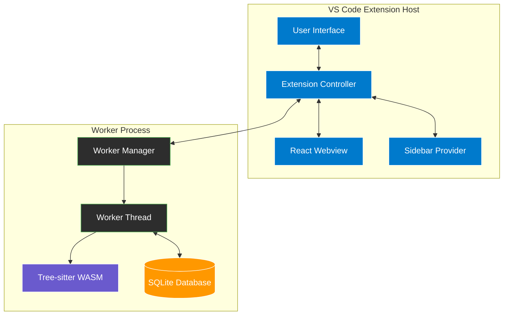
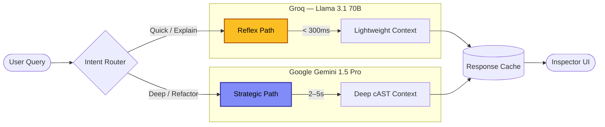

<div align="center">

# 🛡️ Sentinel Flow

### Advanced Codebase Intelligence and Visualization for VS Code

[](https://code.visualstudio.com/)
[](https://nodejs.org/)
[](LICENSE)
[](https://www.typescriptlang.org/)

**Sentinel Flow** transforms your codebase into an interactive, AI-powered knowledge graph. Get deep architectural insights, real-time dependency tracking, and intelligent code analysis — all without leaving VS Code.

[**Getting Started**](#-getting-started) · [**Features**](#-features) · [**Architecture**](#-architecture) · [**AI Integration**](#-ai-integration) · [**Configuration**](#-configuration) · [**Contributing**](#-development)

---

<!-- 
  💡 IMAGE SUGGESTION: 
  Add a hero GIF/screenshot here showing the interactive graph in action.
  Ideal size: 1280×720px. Capture the Architecture Mode with a real project loaded,
  the Inspector Panel open, and the AI chat responding to a query.
  Command to record: use VS Code's built-in screen recorder or tools like LICEcap/Kap.
  
  Example:
  
-->

</div>

---

## 📋 Table of Contents

- [Overview](#-overview)
- [Features](#-features)
- [Architecture](#-architecture)
- [Design Decisions & Trade-Offs](#️-design-decisions--trade-offs)
- [Getting Started](#-getting-started)
- [Usage Guide](#-usage-guide)
- [AI Integration](#-ai-integration)
- [Configuration](#-configuration)
- [Performance](#-performance)
- [Development](#-development)
- [Contributing](#-contributing)
- [License](#-license)
- [Support](#-support)

---

## 🧭 Overview

Modern codebases grow faster than human comprehension. Sentinel Flow bridges that gap by continuously parsing, indexing, and visualizing your code as a living knowledge graph — enriched by AI that understands both structure and semantics.

Whether you're onboarding to an unfamiliar project, hunting down a hidden dependency, or planning a large-scale refactor, Sentinel Flow gives you the context you need instantly.

---

## ✨ Features

### 🔍 Intelligent Code Indexing

Sentinel Flow parses your codebase at the AST level using Tree-sitter, providing symbol-accurate analysis rather than simple text scanning.

- Multi-language AST parsing — TypeScript, Python, and C supported out of the box
- Incremental indexing with content-hash-based change detection (only re-parses what changed)
- Worker-thread architecture keeps the VS Code UI fully responsive during indexing
- SQLite-backed graph database with O(1) symbol lookups

### 🗺️ Interactive Graph Visualization

Three purpose-built view modes let you zoom from 30,000 feet to individual function calls.

| Mode | What It Shows | Best For |
|------|--------------|----------|
| **Architecture** | High-level domain and module structure | Understanding system organization |
| **Codebase** | Files, symbols, and their relationships | Detailed code navigation |
| **Trace** | Function call chains and impact paths | Debugging and change impact analysis |

All views support real-time filtering, search, and progressive disclosure. Layout is powered by ELK.js for clean, automatic graph rendering.

### 🤖 AI-Powered Analysis

A dual-path AI architecture routes every query to the right model for the job — balancing speed against analytical depth.

```
User Query → Intent Router → Reflex Path (<300ms) or Strategic Path (2–5s)
```

- **Reflex Path** (Groq / Llama 3.1 70B): Near-instant answers for quick lookups and tooltip explanations
- **Strategic Path** (Google Gemini / AWS Bedrock): Deep architectural analysis, refactoring plans, and security audits
- Context-aware prompts include the dependency graph and code metrics for every query
- Response caching prevents redundant API calls and reduces costs

### 🔬 Inspector Panel

Click any node in the graph to open a rich details panel:

- Real-time metrics: cyclomatic complexity, coupling, and fragility scores
- Dependency map: all incoming and outgoing relationships at a glance
- Risk assessment with AI-generated plain-English explanations
- Health score for domains, files, and individual symbols

### 🧹 Technical Debt Detection

- Automated identification of code smells and anti-patterns
- Complexity and coupling metrics with trend tracking
- Blast radius analysis — see exactly which symbols would be affected by a change
- AI-generated, actionable refactoring suggestions

<!--
  💡 IMAGE SUGGESTION:
  Consider adding a 3-panel screenshot here:
    Left: Graph in Codebase Mode
    Center: Inspector Panel open on a high-risk node
    Right: AI chat with a refactoring suggestion
  Filename suggestion: docs/assets/feature-overview.png
-->

---

## 🏗️ Architecture

Sentinel Flow separates concerns cleanly across three layers: the VS Code Extension Host, a background Worker Process, and the React Webview.

### System Overview



### Data Flow Pipelines

**1. Indexing Pipeline**
```
Source Files → Tree-sitter Parser → Symbol Extractor → Composite Index → SQLite Database → Graph Export
```

**2. Visualization Pipeline**
```
Database → Graph Data → View Mode Filter → ELK Layout → React Flow → Webview
```

**3. AI Analysis Pipeline**
```
User Query → Intent Router → Context Assembly (cAST) → AI Client → Response Cache → Inspector UI
```

### AI Routing



---

## ⚖️ Design Decisions & Trade-Offs

To achieve enterprise-grade performance entirely within the local VS Code environment, we had to make specific architectural choices over standard alternatives:

| Technology Choice | The Alternative | Why We Chose It |
| :--- | :--- | :--- |
| **Tree-sitter (WASM)** | *Regex or Standard AST Parsers* | Regex is too fragile for complex code, and standard parsers are slow. Tree-sitter allows us to do **incremental, language-agnostic parsing** at native speeds directly in the browser/worker environment. |
| **SQLite (sql.js)** | *In-Memory JSON or Neo4j* | Neo4j requires external hosting (breaking local privacy). In-memory JSON crashes VS Code on large codebases. SQLite gives us **ACID transactions, O(1) lookups, and minimal memory footprint**. |
| **Dual-Path AI (Groq + Gemini)** | *Routing everything to GPT-4o* | Using a single large model for everything creates terrible UX (3–5s wait times for simple tooltips). Routing "Reflex" queries to **Groq (Llama 3.1) gives us <300ms latency**, saving the heavy lifting for Gemini. |
| **ELK.js Layout Engine** | *D3.js or Force-Directed Graphs* | Force-directed graphs turn into a messy "hairball" with 500+ nodes. ELK (Eclipse Layout Kernel) provides **deterministic, hierarchical layering** which is essential for reading architectural domains. |
| **Worker Thread Architecture** | *Running logic in Extension Host* | Running AST extraction and DB queries in the main extension host would freeze the VS Code UI. Isolating this in a **background worker thread** ensures 60 FPS scrolling and typing, even while indexing 5,000 files. |

---

## 🚀 Getting Started

### Prerequisites

| Requirement | Version |
|-------------|---------|
| VS Code | 1.85.0 or higher |
| Node.js | 20.0.0 or higher |

> **Note:** API keys are optional but strongly recommended for AI features. See [AI Integration](#-ai-integration) for provider details.

### Installation

**Option A — VS Code Marketplace** *(coming soon)*

Search for `Sentinel Flow` in the VS Code Extensions panel.

**Option B — Build from Source**

```bash
git clone https://github.com/innovators-of-ai/sentinel-flow-extension.git
cd sentinel-flow-extension
npm install
npm run build
```

### Configure AI Providers

1. Open the Command Palette: `Ctrl+Shift+P` (Windows/Linux) or `Cmd+Shift+P` (macOS)
2. Run: **`Sentinel Flow: Configure AI Keys`**
3. Enter your API credentials for your chosen provider(s)

### First Use

```
1. Open a workspace/project in VS Code
2. Click the Sentinel Flow icon in the Activity Bar
3. Click "Update Workspace Index" to begin indexing
4. Once complete, click "Open Architecture Graph"
```

<!--
  💡 IMAGE SUGGESTION:
  A numbered annotated screenshot of the VS Code Activity Bar with the Sentinel Flow
  icon highlighted, and the Sidebar open showing the "Update Workspace Index" and
  "Open Architecture Graph" buttons.
  Filename suggestion: docs/assets/quickstart-sidebar.png
-->

---

## 📖 Usage Guide

### Commands

| Command | Description |
|---------|-------------|
| `Sentinel Flow: Index Workspace` | Parse and index all supported files |
| `Sentinel Flow: Visualize Code Graph` | Open the interactive graph |
| `Sentinel Flow: Query Symbols` | Search for specific symbols |
| `Sentinel Flow: Export Graph as JSON` | Export graph data for external tools |
| `Sentinel Flow: Configure AI Keys` | Set up AI provider credentials |
| `Sentinel Flow: Clear Index` | Reset the database |

### View Modes

#### Architecture Mode
Renders your project as a high-level domain map. Folders become architectural domains; edges represent cross-domain dependencies. Use this when you need to orient yourself in an unfamiliar codebase or plan a cross-cutting change.

#### Codebase Mode
Displays the full symbol graph at three depth levels — Domain → File → Symbol — with edges showing imports and function calls. Use this for detailed code navigation and tracing exact dependency chains.

#### Trace Mode
Isolates a function's call chain and visualizes its blast radius: every symbol that would be affected by a change. Use this for debugging, impact analysis, and planning safe refactors.

### Inspector Panel

Click any node to open the Inspector Panel on the right:

- **Overview** — basic metrics and file metadata
- **Dependencies** — incoming and outgoing relationship list
- **Risks & Health** — complexity, coupling, and fragility scores with color-coded indicators
- **AI Actions** — generate explanations, suggest refactors, or run a security audit on the selected symbol

### Search & Filtering

- **Search Bar** — filter by symbol name or AI-generated tags (minimum 3 characters)
- **Domain Filter** — scope the graph to a specific architectural domain
- **Sort Options** — sort by name, complexity, fragility, or blast radius
- **Depth Control** — toggle between Domain, File, and Symbol level views

---

## 🧠 AI Integration

### Supported Providers

#### ⚡ Groq — Reflex Path

| Property | Value |
|----------|-------|
| Model | Llama 3.1 70B |
| Typical Latency | < 300ms |
| Best For | Quick queries, tooltips, single-symbol explanations |
| Get API Key | [console.groq.com/keys](https://console.groq.com/keys) |

#### 🔭 Google Gemini — Strategic Path

| Property | Value |
|----------|-------|
| Model | Gemini 1.5 Pro |
| Typical Latency | 2–5s |
| Best For | Deep analysis, refactoring plans, architecture insights |
| Get API Key | [aistudio.google.com/app/apikey](https://aistudio.google.com/app/apikey) |

#### ☁️ AWS Bedrock — Strategic Path

| Property | Value |
|----------|-------|
| Default Model | Amazon Nova 2 Lite |
| Typical Latency | 3–8s |
| Best For | Enterprise deployments, AWS-integrated workflows |
| Setup | Configure AWS credentials in VS Code settings |

### Intent Routing

Sentinel Flow automatically classifies each query and selects the right model — no manual selection required.

| Query Type | Example | Routed To |
|------------|---------|-----------|
| Reflex | *"What does this function do?"*, *"Explain this class"* | Groq |
| Strategic | *"How should I refactor this module?"*, *"What are the security risks here?"* | Gemini / Bedrock |

### Context Assembly (cAST)

Every AI prompt is enriched with structured context pulled directly from the graph:

- Target symbol's source code
- Dependency subgraph (incoming and outgoing edges)
- Architectural pattern hints
- Complexity, coupling, and fragility metrics

---

## ⚙️ Configuration

Access settings via **Settings → Extensions → Sentinel Flow**.

| Setting | Description | Default |
|---------|-------------|---------|
| `sentinelFlow.groqApiKey` | Groq API key for fast analysis | — |
| `sentinelFlow.geminiApiKey` | Google Gemini API key | — |
| `sentinelFlow.vertexProject` | Google Cloud Project ID for Vertex AI | — |
| `sentinelFlow.aiProvider` | Strategic path provider (`gemini` or `bedrock`) | `gemini` |
| `sentinelFlow.awsRegion` | AWS region for Bedrock | `us-east-1` |
| `sentinelFlow.bedrockModelId` | Bedrock model ID | `us.amazon.nova-2-lite-v1:0` |
| `sentinelFlow.useLSP` | Enable LSP-based type resolution | `false` |

### Auto-Indexing

Toggle auto-indexing in the Sentinel Flow Sidebar:

- **Enabled** — automatically re-indexes whenever workspace files change
- **Disabled** — manual indexing only via the Command Palette

---

## 📈 Performance

### Optimization Techniques

Sentinel Flow is engineered to stay fast on codebases of any size through several layered strategies:

- **Incremental Indexing** — only re-parses files whose content hash has changed
- **Worker Thread Isolation** — CPU-intensive parsing never blocks the VS Code UI thread
- **Binary String Registry** — O(1) symbol lookups via pre-interned string identifiers
- **Composite Index** — fast cross-file edge resolution without full table scans
- **Response Caching** — AI responses are cached in SQLite to avoid redundant API calls
- **Progressive Disclosure** — the graph renderer only processes nodes currently in the viewport
- **Edge Deduplication** — repeated relationships are collapsed to reduce visual clutter

### Benchmarks

| Metric | Small (50 files) | Medium (500 files) | Large (5,000 files) |
|--------|------------------|--------------------|---------------------|
| Symbols | 500 | 5,000 | 50,000 |
| Initial Index | ~2s | ~15s | ~120s |
| Incremental Update | < 100ms | < 500ms | < 2s |
| Graph Render | < 100ms | < 300ms | < 1s |
| AI Query (Reflex) | < 300ms | < 300ms | < 300ms |
| AI Query (Strategic) | 2–5s | 2–5s | 2–5s |

---

## 🛠️ Development

### Build from Source

```bash
# Install all dependencies
npm install
cd webview && npm install && cd ..

# Production build
npm run build

# Development watch mode
npm run watch

# Run test suite
npm test
```

### Project Structure

```
sentinel-flow-extension/
├── src/
│   ├── extension.ts              # Extension entry point
│   ├── ai/                       # AI orchestration layer
│   │   ├── orchestrator.ts       # Main AI controller
│   │   ├── intent-router.ts      # Query classification
│   │   ├── groq-client.ts        # Groq integration
│   │   ├── gemini-client.ts      # Gemini integration
│   │   └── bedrock-client.ts     # Bedrock integration
│   ├── worker/                   # Background processing
│   │   ├── worker.ts             # Worker thread entry point
│   │   ├── parser.ts             # Tree-sitter wrapper
│   │   ├── symbol-extractor.ts   # AST traversal logic
│   │   ├── composite-index.ts    # Cross-file symbol resolution
│   │   └── inspector-service.ts  # Per-node analysis
│   ├── db/                       # Database layer
│   │   ├── database.ts           # SQLite operations
│   │   └── schema.ts             # Data models and types
│   └── domain/                   # Business logic
│       ├── classifier.ts         # Domain classification
│       └── health.ts             # Health metric calculations
└── webview/                      # React visualization app
    ├── src/
    │   ├── App.tsx               # Root component
    │   ├── components/           # UI components
    │   ├── stores/               # Zustand state management
    │   └── utils/                # Layout and filtering helpers
    └── package.json
```

---

## 🤝 Contributing

Contributions are very welcome. Please read [CONTRIBUTING.md](CONTRIBUTING.md) before opening a pull request. For major changes, open an issue first to discuss what you'd like to change.

---

## 🙏 Acknowledgments

This project would not be possible without the following open-source projects and services:

- [Tree-sitter](https://tree-sitter.github.io/) — multi-language AST parsing
- [React Flow](https://reactflow.dev/) — interactive graph visualization
- [ELK.js](https://github.com/kieler/elkjs) — automatic graph layout
- [Groq](https://groq.com/), [Google Gemini](https://deepmind.google/technologies/gemini/), and [AWS Bedrock](https://aws.amazon.com/bedrock/) — AI capabilities
- The [VS Code team](https://github.com/microsoft/vscode) for the extension API

---

## 📄 License

This project is licensed under the **MIT License** — see [LICENSE](LICENSE) for full details.

---

## 💬 Support

| Channel | Link |
|---------|------|
| Bug Reports & Feature Requests | [GitHub Issues](https://github.com/innovators-of-ai/sentinel-flow-extension/issues) |
| Documentation | [sentinel-flow.dev](https://sentinel-flow.dev) *(coming soon)* |
| Community Discord | [discord.gg/sentinel-flow](https://discord.gg/sentinel-flow) *(coming soon)* |

---

<div align="center">

**Built with ❤️ by the [Innovators of AI](https://github.com/innovators-of-ai) team**

</div>
